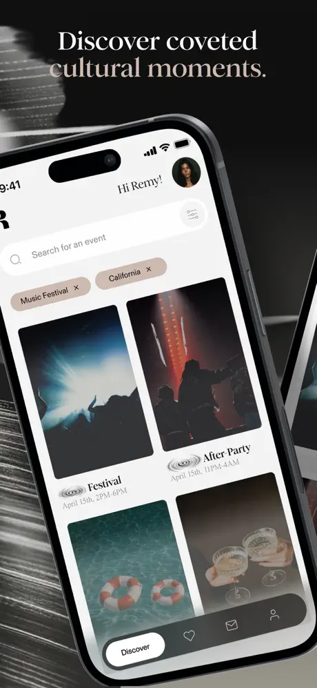
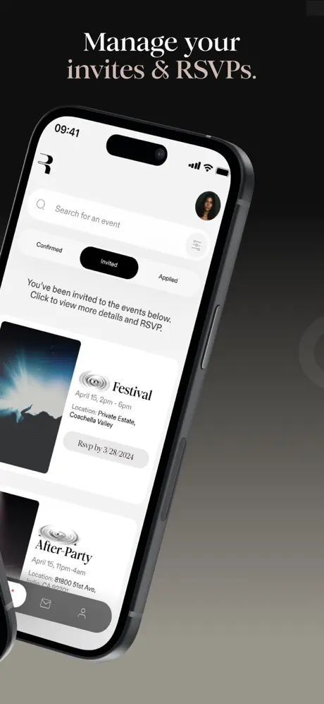
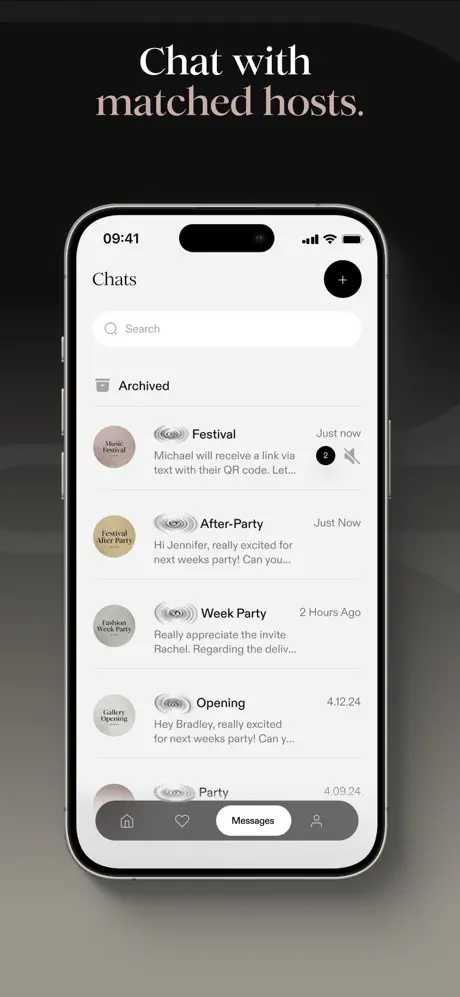

# Portfolio
I am a Mobile App Developer specializing in iOS application development and cross-platform mobile development using React Native. I focus on building scalable, high-performance mobile applications with strong attention to code quality, performance, and user experience.

My core technical expertise includes Swift, SwiftUI, UIKit, Objective-C, Xcode, and modern iOS frameworks, along with React Native for cross-platform solutions. I work with REST and GraphQL APIs, follow MVVM and Clean Architecture, and implement CI/CD workflows to support maintainable and production-ready mobile systems.

I have hands-on experience across the full mobile app development lifecycle, from requirements analysis and architecture design to implementation, optimization, testing, and deployment to the App Store. I collaborate closely with designers, product managers, and backend teams to deliver reliable and user-centric mobile applications.

I value clean, maintainable code, scalable architectures, and continuous improvement. I actively stay updated with the latest advancements in iOS development, React Native, and mobile engineering best practices, and I enjoy taking on new challenges that drive technical and product excellence.

### **Professionnal Skills**  
* iOS Development
* Swift
* SwiftUI
* UIKit
* Objective-C
* React Native Development
* Cross-Platform Mobile Applications
* CocoaPods
* Xcode
* Auto Layout & Responsive UI Design
* RESTful API Integration
* GraphQL Integration
* In-App Purchases & Apple Pay
* Push Notifications (APNS)
* Pusher Integration for Chat
* Twilio Integration for Video Calling
* Firebase (Auth, Firestore, FCM, Analytics)
* Google Maps & Google Location Services
* Payment Gateway Integrations
* Alamofire
* MVVM, Clean Swift, MVC
* Coordinator Pattern
* Git & Version Control
* CI/CD Workflows
* Debugging & Performance Optimization

# [**RUMOR: Invites That Matter**](https://apps.apple.com/ke/app/rumor-invites-that-matter/id6503365397)

Rumor connects the dots between hosts of exclusive experiences with their ideal curated audience. Members of our community can directly connect with hosts to RSVP, manage invitation status, access event details including QR codes for entry, and more. Prospective members can submit the brief application and access our community once approved. As a host, Rumor is your backend infrastructure to manage your guest-list and RSVP process, with many unique features built specifically for the needs of hosts of curated moments.

 

# [**RACETOFREEDOM**](https://apps.apple.com/gb/app/racetofreedom/id6473527134)

RaceToFreedom is a training platform that offers users a diverse range of entrepreneurial courses (skilled-based) and the opportunity to connect with advisors. Users embark on a structured journey, starting as trainees and progressing through onboarding steps. Upon completion, they engage in a detailed discussion with an advisor, who, based on the assessment, unlocks access to various courses. As the advisor monitors the trainee's progress, they may grant advisor privileges, transforming the trainee into an advisor, and the cycle repeats. 
The platform allows users to progress at different levels and then help others to learn through the same path. Transform your future with RaceToFreedom's dynamic video courses. Empower your entrepreneurial journey!

# [**Circl - Wellness Marketplace**](https://apps.apple.com/us/app/circl-wellness-marketplace/id1526462647)

Circl is a new social booking and creator marketplace for wellbeing professionals and those looking to find them. This app has two user ends one is the Customer and the other one is the Freelancer. Users as Freelancers can register themselves and can set their availability using the calendar. Add different demo videos images, subscription content, public content, Stories, etc. On the other end, the User as a Customer can set appointments and subscribe to their content as well and many more.

# [**BOATEK**](https://apps.apple.com/us/app/boatek/id1601366440)

Boatek is an easy to use application through which boats of all types that are owned by individuals can be rented out so that customers who need the boat for a few hours or days can use it according to their liking. The boat-owner simply has to register his boat on Boatek along with its location and features. The customer can log into the app and choose a boat according to their liking and book their preferred time-slot and enjoy a wonderful experience of exploring the waters.

# [**OWLMI**](https://apps.apple.com/us/app/owlmi/id1640674357)

OWLMI is a platform connecting fans with a new generation of expertise. Book 1:1 video calls and access exclusive content from your favorite experts, professionals and influencers. 
OWLMI is an easy and fun way for professionals to monetize intellectual knowledge and experience.
* Easily Schedule bookigs & 1:1 Video Calls with Professionals  
* Subscribe professionals to access their private content  

# [**Directooo**](https://apps.apple.com/us/app/directooo/id1565324549)

Directooo is an app connecting influencers and celebrities with their fans, a paid social media platform to browse, discover, and interact with your
favorite influencers for a price!  
Fans pay creators in exchange for exclusive content, special requests (ex: birthday greeting) or pay a monthly subscription to gain full access to their page. Creators are now able to have a new stream of monthly income and fans are one step closer to the influencers they love most! With every transaction, a percentage of the proceedings go to PR, Networks and NGO’s.

# [**Gears Unlimited**](https://apps.apple.com/us/app/gears-unlimited/id1488106848)

Gears Unlimited is an Exclusive App for DJs. Buy, Rent & Trade For new and used Dj equipment

# [**Menuons**](https://apps.apple.com/us/app/menuons/id1344697421)

The Mobile App of Menuons Food Online Delivery System with localization (English/Arabic)
* All Menu on your phone  
* Delivery or Pick up Feature  
* Payments  
* Notifications on order status  

